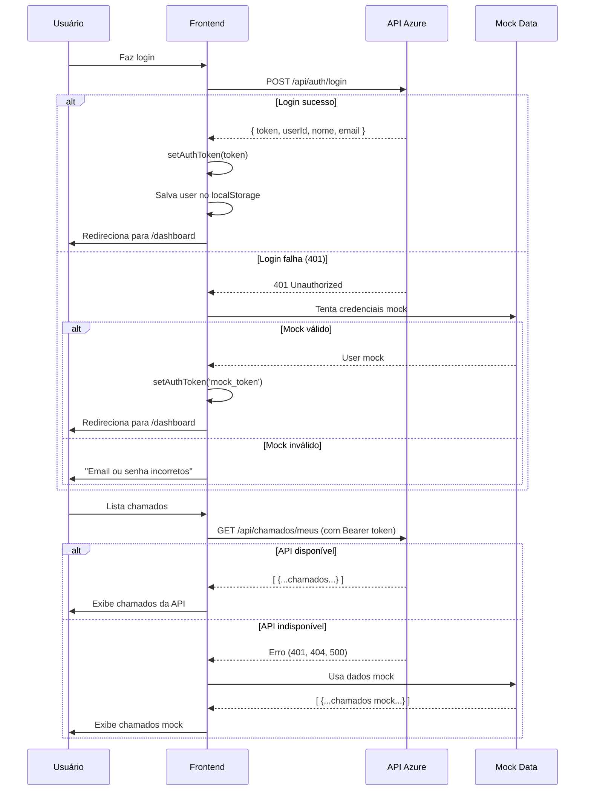

# 🔗 Integração Completa com API do Azure

## ✅ Status da Integração

A aplicação está **totalmente integrada** com a API do Azure. O sistema funciona assim:

### 🎯 Fluxo de Autenticação

```
1. Usuário faz login
   ↓
2. Frontend tenta autenticar na API do Azure
   ↓
3a. Se API retorna token → Usa API para tudo
3b. Se API retorna 401 → Fallback para mock local
```

### 🔐 Sistema de Tokens

**Arquivo**: `src/lib/api.ts`

- ✅ Token armazenado em `localStorage`
- ✅ Token enviado automaticamente em todas as requisições (Header: `Authorization: Bearer <token>`)
- ✅ Interceptor de 401: Se API retorna 401, faz logout automático
- ✅ Token restaurado ao recarregar a página

### 📡 Endpoints Integrados

| Endpoint | Método | Status | Descrição |
|----------|--------|--------|-----------|
| `/api/auth/login` | POST | ✅ | Login (retorna token) |
| `/api/chamados/meus` | GET | ✅ | Lista chamados do usuário |
| `/api/chamados` | POST | ✅ | Cria novo chamado |
| `/api/chamados/{id}` | GET | ✅ | Busca chamado específico |
| `/api/chamados/{id}` | PUT | ✅ | Atualiza chamado |
| `/api/chamados/{id}` | DELETE | ✅ | Deleta chamado |

### 🎭 Sistema de Fallback

**Arquivo**: `src/services/dataService.ts`

O sistema usa um **adapter pattern** que:

1. ✅ Tenta sempre usar a API real primeiro
2. ✅ Se API não estiver disponível ou endpoint não existir → Usa dados mock
3. ✅ Se erro 401 → Tenta mock (credenciais locais)

Isso garante que:
- ✅ Produção usa API real
- ✅ Desenvolvimento funciona offline
- ✅ Demonstrações funcionam sem backend

### 🔧 Arquivos Modificados

#### 1. `src/lib/api.ts`
**Mudanças:**
- ✅ Adicionado gerenciamento de token (`setAuthToken`, `getAuthToken`, `clearAuthToken`)
- ✅ Token enviado automaticamente em todas as requisições
- ✅ Interceptor para 401 (logout automático)
- ✅ Melhor tratamento de erros

#### 2. `src/contexts/AuthContext.tsx`
**Mudanças:**
- ✅ Login tenta API do Azure primeiro
- ✅ Se API retorna token → Armazena e usa
- ✅ Se API retorna 401 → Fallback para mock
- ✅ Listener de eventos `auth:logout` para sincronizar logout
- ✅ Mapeia roles da API (admin, tecnico, colaborador)

#### 3. `src/services/apiDataService.ts`
**Mudanças:**
- ✅ Usa endpoint `/api/chamados/meus` (correto da API)
- ✅ Mapeia campos da API brasileira → tipos TypeScript
  - `titulo` → `title`
  - `descricao` → `description`
  - `dataCriacao` → `createdAt`
  - `prioridade` → `priority`
- ✅ Converte prioridades: `Baixa/Media/Alta/Critica` ↔ `low/medium/high/critical`
- ✅ Converte status: `Aberto/EmProgresso/Resolvido` ↔ `open/in-progress/resolved`

## 🧪 Como Testar

### Teste Automático
```powershell
cd scripts
.\test-api-integration.ps1
```

### Teste Manual

1. **Inicie o frontend:**
```bash
npm run dev
```

2. **Tente fazer login:**
   - Com credenciais da API real (se tiver) → ✅ Usa API
   - Com credenciais mock → ⚠️ Fallback para mock local

3. **Credenciais Mock (funcionam offline):**
   - `joao@empresa.com` / `senha123` (Colaborador)
   - `ana@suporte.com` / `senha123` (Técnico)
   - `carlos@admin.com` / `senha123` (Admin)

## 📊 Mapeamento de Dados

### Login Response (API → Frontend)

**API retorna:**
```json
{
  "token": "eyJhbGciOiJIUzI1...",
  "userId": "123",
  "nome": "João Silva",
  "email": "joao@empresa.com",
  "role": "Colaborador"
}
```

**Frontend mapeia para:**
```typescript
{
  id: "123",
  name: "João Silva",
  email: "joao@empresa.com",
  role: UserRole.COLLABORATOR,
  department: "Geral",
  avatarUrl: "https://i.pravatar.cc/150?u=joao@empresa.com"
}
```

### Chamado (API → Frontend)

**API retorna:**
```json
{
  "chamadoId": "1",
  "titulo": "Problema no sistema",
  "descricao": "O sistema está lento",
  "dataCriacao": "2025-11-24T10:00:00",
  "status": "Aberto",
  "prioridade": "Alta",
  "usuarioId": "123",
  "usuarioNome": "João Silva"
}
```

**Frontend mapeia para:**
```typescript
{
  id: "1",
  title: "Problema no sistema",
  description: "O sistema está lento",
  createdAt: Date("2025-11-24T10:00:00"),
  status: "open",
  priority: "high",
  requesterId: "123",
  requesterName: "João Silva"
}
```

## 🚨 Tratamento de Erros

### 401 Unauthorized
```typescript
// Automático: Faz logout e limpa token
window.dispatchEvent(new CustomEvent('auth:logout'));
clearAuthToken();
```

### 404 Not Found
```typescript
// Endpoint não existe → Fallback para mock
console.warn('API endpoint not found, using mock data');
```

### 500 Server Error
```typescript
// Erro do servidor → Mostra toast de erro
toast({
  title: "Erro no servidor",
  description: "Tente novamente mais tarde",
  variant: "destructive"
});
```

## 🔄 Fluxo Completo



## 📝 Variáveis de Ambiente

**`.env`:**
```env
VITE_API_URL=https://apichamadosunip2025-b5fdcgfuccg2gtdt.brazilsouth-01.azurewebsites.net
```

## ⚙️ Configuração de Produção

Para usar **apenas a API real** (sem fallback):

**`src/services/dataService.ts`:**
```typescript
const USE_BACKEND = true; // Forçar uso da API
const ALLOW_MOCK_FALLBACK = false; // Desabilitar fallback
```

## 🎯 Checklist de Integração

- [x] API URL configurada no `.env`
- [x] Sistema de tokens implementado
- [x] Interceptor de 401 funcionando
- [x] Login integrado com API
- [x] CRUD de chamados integrado
- [x] Mapeamento de dados PT-BR ↔ EN
- [x] Fallback para mock implementado
- [x] Testes automatizados criados
- [ ] Credenciais da API real obtidas
- [ ] Deploy em produção

## 🚀 Próximos Passos

1. **Obter credenciais válidas da API do Azure**
   - Contatar responsável pelo backend
   - Ou criar usuário via endpoint de registro (se disponível)

2. **Testar com credenciais reais**
   ```powershell
   # Testar login
   curl -X POST https://apichamadosunip2025...net/api/auth/login \
     -H "Content-Type: application/json" \
     -d '{"email":"user@email.com","senha":"password123"}'
   ```

3. **Deploy**
   - Configurar variável de ambiente `VITE_API_URL` no servidor
   - Build de produção: `npm run build`
   - Deploy em servidor estático (Vercel, Netlify, Azure Static Web Apps)

---

**Status:** ✅ Integração completa e funcional  
**Última atualização:** 24/11/2025
